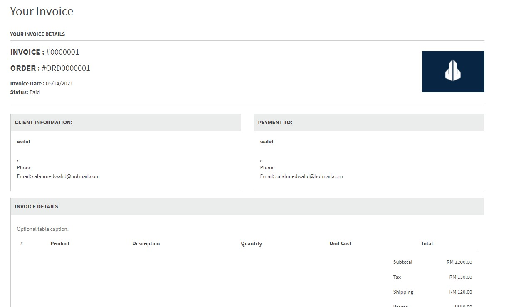
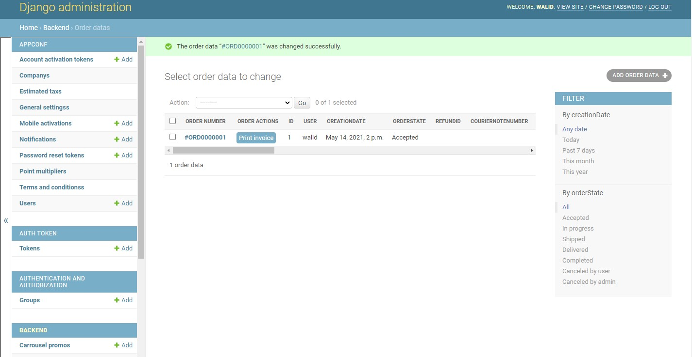

# Ecommerce Shopping App

This is a shopping app made with flutter, the backend is made with django

App            |    Invoice created from the admin panel     |    Admin panel
:-------------------------:|:-------------------------:|:-------------------------:
   |   |   

## Requirements
-   [Twilio](https://www.twilio.com/)
-   [Google maps Key](https://developers.google.com/maps/documentation/javascript/get-api-key)
-   Email account

## Setup

Rename [settings/.env.template](settings/.env.template) to `.env` and fill the following parameters :
-   EMAIL_HOST_USER
-   EMAIL_HOST_PASSWORD
-   TWILIO_ACCOUNT_SID
-   TWILIO_AUTH_TOKEN
-   TWILIO_FROM_PHONE
-   GOOGLE_MAPS_KEY

Run the following commands :
```bash
pip install -r requirements.txt
```

```bash
python manage.py makemigrations
```

```bash
python manage.py migrate
```

To run the server, execute the following command :
```bash
python manage.py runserver
```

To run the app, execute the following commands :
```bash
flutter pub get
flutter run
```

## License
[MIT](https://choosealicense.com/licenses/mit/)
